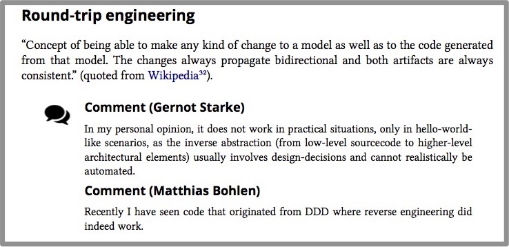

# iSAQB Glossary of Software Architecture Terminology

A comprehensive glossary of software architecture terminology,
many of them used in the iSAQB foundation and advanced level curricula.


This repository contains the sources for the published version of
the iSAQB glossary, available both online and in various eBook formats
at [Leanpub (https://leanpub.com/isaqbglossary)](https://leanpub.com/isaqbglossary).

We also keep our reference translations, currently between English <-> German,
these are [generated](#generating-the-translation-tables) from a JSON document into the markdown book source. 

This book is made possible by **collaborative effort** of several
[iSAQB e.V.](http://isaqb.org) members.
It's intended to **support the non-profit interests** of
the iSAQB and the software architecture community in general.


## Suggestions Welcome

We welcome suggestions and critique of any kind: Just
[open an issue](https://github.com/isaqb-org/glossary/issues)
here on Github!

## Book Generation (aka "build")

Preview and production builds have to be triggered via the Leanpub website,
as somehow the webhooks didn't seem to work (suggestions welcome).


## About Translation tables

The tables are generated by a small Groovy script from a JSON file. Its format is a simple list
with map entries, in file `translations/isaqb-terms-translated.json`.
 

```
[
  { en: "Appropriateness",
    de: "Angemessenheit"
  },
  { en: "Architectural View",
    de: ["Architektursicht", "Sicht"]
  }
  // many more words...
]  
```

If a single (English) term has multiple translations,
as in line 6 (`de: ["Architektursicht", "Sicht"]`), use a JSON list.

This file is parsed, lightly validated for syntax errors and then converted
to Leanpub-flavored Markdown, one table
per language, currently German ("de") and English ("en").

### Generating the Translation Tables
You can build the translation tables by calling `./gradlew generateTables` (on unix or osx) or `.\gradlew.bat generateTables` from the command line.

The translator generates one markdown file for every language - currently
you need to manually copy those into the `manuscript/generated-dont-edit`
directory.

The translation tables currently **only support two languages**, EN and DE.

### Rules for Translation

1. English is the _master_ language, code "en".
2. Every entry needs to have an English term.
3. Every entry must have at least a single translation to another language,e.g. from en to de.
4. A term might have a list of translations
in other languages (e.g. en:Tradeoff translates
to de:[Kompromiss, Abwägung]

## About Term translations

Each term can be described in multiple languages, denoted by the `{lang=[language-code]}` in their respective files (`manuscript/terms`).

### Generating translated terms
You can build the markdown file of all terms that contain a translation to a specific language by calling `./gradlew generateTerms --args="<language-code>"` (on unix or osx) or `.\gradlew.bat generateTerms --args="<language-code>"`, where `<language-code>` stands for the desired language output.

Example:

    ./gradlew generateTerms --args="de"

The translator generates one markdown file - currently you need to manually copy this into the `manuscript/generated-dont-edit` directory.

## About personal opinion

As this book combines the efforts of several authors, some _personal opinions_ or
comments might be added, to give a broader perspective on some definitions.

If you want to add your opinion or comment to any term in the glossary, please
use the "discussion sidebar" syntax like shown below:

```
D> ###### Comment (Gernot Starke)
D> In my personal opinion, it does not work in practical situations, only in hello-world-like scenarios, as the inverse abstraction (from low-level sourcecode to higher-level architectural elements) usually involves design-decisions and cannot realistically be automated.
D>
D> ###### Comment (Matthias Bohlen)
D>Recently I have seen code that originated from DDD where reverse engineering did indeed work.
```

This will yield the following output (captured from the pdf version, will look different in web or epub versions):




## Contributors

The initial version of this glossary has been contributed by [Gernot Starke](http://gernotstarke.de).
Prior versions of the (German) iSAQB glossary had been compiled and
edited by Dr. Ulrich Becker, Wolfgang Fahl, Phillip Ghadir, Dr. Peter Hruschka, Dr. Carola Lilienthal, Martin Roesch and others.


Currently the content is maintained by volunteers from the [iSAQB e.V.](http://isaqb.org),
a non-profit volunteer association - see the contributors list of this repository.

#### How to Become Contributor

You can become contributor (and will be added to the Leanpub contributor page) if
you:

1. Fix 3 or more issues from the Github issue list
2. Open 5 significant issues (typos, spelling mistakes, simple formating issues and
  other trivial stuff does not qualify as _significanct_).
3. Provide significant input by mail or other means to existing authors.
Statements of the form "xy should be done, but I won't do it.." without further
contributions do not qualify as _significant_.  

#### How to Become an Author

You will be promoted to the Leanpub author list of the book if you either:

1. Provide 3 or more new definitions of terms that will be accepted by the
existing authors.
2. Substantially enhance 5 or more definitions that will be accepted by the
existing authors. Examples: Include diagrams to illustrate patterns or concepts.
3. Substantially enhance other aspects of the glossary that will be accepted by the
existing authors.
4. Crosscheck one (complete) CPSA-Advanced Level module for terms missing in
the glossary.
(You need a (free) Leanpub account to become an author.)

## Donating to EEF (Electronic Frontier Foundation)

All royalties from Leanpub sales of this book are donated to
the [Electronic Frontier Foundation (eff.org)](http://eff.org).


## License

This book is licensed under a
[Creative Commons Attribution 4.0 International License](https://creativecommons.org/licenses/by/4.0/).


The following is only a brief summary and no substitution for the real
[licence](https://creativecommons.org/licenses/by/4.0/).


The cc-4.0-by license means that you might:

* Share — copy and redistribute the material in any medium or format
* Adapt — remix, transform, and build upon the material for any purpose, even commercially.
* The licensor cannot revoke these freedoms as long as you follow the license terms.

You must:

* Give **appropriate credit**,
* Provide a link to the license (https://creativecommons.org/licenses/by/4.0/), and
* Indicate if changes were made.
